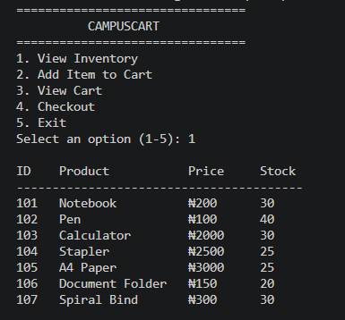
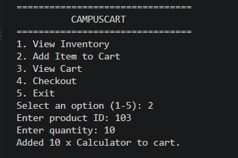
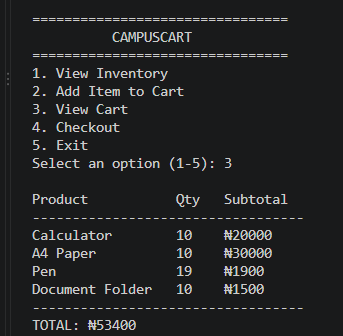
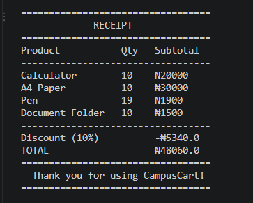
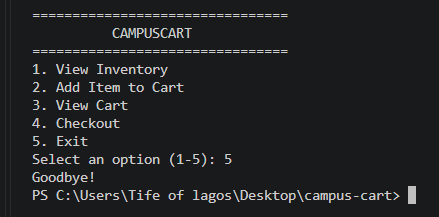

# CampusCart

> A command-line tool that lets students browse campus vendor products, build a cart, and check out with a receipt.

---

## Overview

CampusCart is a command-line tool that helps students shop from campus vendors quickly and accurately, browsing available products, building a cart, and checking out with an itemized receipt, without needing a physical point-of-sale system.

## Problem Statement

Campus vendors, including small food sellers and pop-up shops, often manage sales manually, leading to slow service, pricing errors, and no clear record of what was purchased. CampusCart addresses this by giving students a simple, self-service way to browse a vendor's stock and complete a purchase, while automatically keeping the vendor's inventory accurate behind the scenes.

## Target Users

- Students shopping from campus vendors
- Student-run businesses on campus
- Pop-up vendors selling food, snacks, or accessories

## Core Features

- View available products with price and stock
- Add items to a cart, with stock validated in real time
- Review the cart and running total before checkout
- Generate an itemized receipt with automatic discounts
- Inventory updates automatically after checkout

## Value Proposition

- **Fast setup** — no installation or training needed to browse and buy
- **Accurate stock checks** — prevents buying more than what's available, even across multiple additions to the cart
- **Clear receipts** — itemized, with discounts applied automatically
- **Built for campus life** — designed around how students actually shop on the go

## User Personas

| Persona | Role | Core Need |
| :--- | :--- | :--- |
| **Customer** | Student purchasing from a vendor | A quick, accurate way to browse products and check out with a clear total |
| **Vendor** | Campus food or goods seller | Inventory that stays accurate without manual recordkeeping after each sale |

## Proposed CLI Interface

```
================================
CAMPUSCART
1. View Inventory
2. Add Item to Cart
3. View Cart
4. Checkout
5. Exit

Select an option (1-5): _
```
## Getting Started

The CLI application has been built in Python. To run it:

​```
python main.py
​```

This launches the interactive menu shown below.

## CLI Demo

### Viewing Inventory


### Adding an Item to Cart


### Viewing the Cart


### Checkout with Receipt


### Exiting the Program
